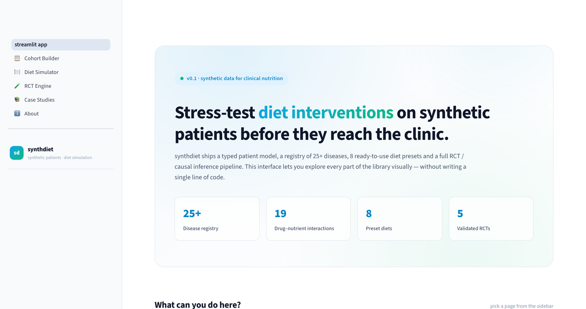

# synthdiet

[](https://pypi.org/project/synthdiet/)
[](https://pypi.org/project/synthdiet/)
[](https://opensource.org/licenses/MIT)
[](https://github.com/bugraayancom/synthdiet/actions/workflows/ci.yml)

> 他言語: [English](README.md) · [Türkçe](README.tr.md) · [Español](README.es.md) · [Français](README.fr.md) · [Deutsch](README.de.md) · [Português](README.pt.md) · [Italiano](README.it.md) · [中文](README.zh.md)
`synthdiet` は、現実的な臨床像をもつ**合成患者を生成**し、
それらに**食事介入をシミュレーション**するための Python ライブラリ
です。

栄養士、臨床栄養研究者、教育者が、食事プロトコルをプロトタイプし、
仮想試験を実施し、実臨床に持ち込む前に数百〜数千の合成患者で
栄養推奨をストレステストすることを目的に設計されています。

> 注意: `synthdiet` は研究および教育用ツールです。出力される数値は
> **臨床推奨ではなく**、合成患者は**実在の人物ではありません**。
> 患者ケアには必ず資格を持つ管理栄養士・登録栄養士に相談してください。



---

## 著者

**Buğra Ayan** —— トルコ・アンカラ
- ウェブサイト: <https://bugraayan.com>
- メール: <bugraayan.com@gmail.com>
- Google Scholar: <https://scholar.google.com/citations?user=VHGqzNMAAAAJ&hl=tr>

---

## 機能

### コア・ドメインモデル
- 人口統計、人体計測、生活習慣、検査バイオマーカー、診断、現用薬を
  集約する型付きの `Patient` クラス。
- 内分泌・循環器・腎臓・肝臓・消化器・代謝・運動器・腫瘍・精神・
  アレルギー領域にまたがる **25 以上の疾患** を網羅したレジストリ。
- 臨床上重要な **19 の薬剤-栄養素相互作用** のレジストリ
  (メトホルミン → B12、スタチン → グレープフルーツ、ワルファリン →
  ビタミン K、レボチロキシン服用タイミング、MAOI とチラミン危機など)。
- 合成患者の 5 種類のジェネレータ(ランダム、分布、コピュラ、
  コホート、マルコフ進行)。
- マクロ・微量栄養素分解付き 45 食品の食品データベースと、
  8 種のプリセット食(地中海、DASH、ケトジェニック、低 FODMAP、
  低ナトリウム腎臓、糖尿病、ビーガン、標準)。

### 方法論的な厚み(v0.1)
- オプションの **Hall 2011 体組成モデル**
  (`DietSimulator(engine="hall_2011")`)。Forbes 式による脂肪量・
  除脂肪量分配と適応的熱産生を含む。
- **アドヒアランスとドロップアウト動態**: 一定、減衰、Weibull、
  確率的飛ばし、知覚負担。
- **RCT エンジン** (`synthdiet.trials`): 並行群、クロスオーバー、
  2×2 要因デザイン。層別/ブロック/最小化ランダム化、ドロップ
  アウトモデル、ITT/PP/AT 解析。
- **因果推論** (`synthdiet.causal`): 反事実シミュレーション、
  ATE/CATE 推定、IPTW と g-公式による交絡実験、軽量 DAG。
- **食事品質指標** (`synthdiet.indices`): HEI-2020、AHEI-2010、
  MEDAS、DASH スコア、PHDI、DII。
- **統計ヘルパー** (`synthdiet.stats`): 連続・二値アウトカム向け
  検出力分析、ブートストラップ CI、並べ替え検定、
  Benjamini-Hochberg / Holm-Bonferroni 補正、ベースライン調整 ANCOVA。
- **測定誤差・欠測注入** (`synthdiet.noise`): アッセイ別 CV%、
  自己申告バイアス、MCAR/MAR/MNAR パターン。
- **15 の臨床ケース + OSCE 形式評価** (`synthdiet.education`)。
- 5 つのランドマーク RCT に対する**バリデーションスイート**
  (`synthdiet.validation`): DASH-Sodium、PREDIMED、DiRECT、
  Look AHEAD、Diabetes Prevention Program。
- **可視化** (`synthdiet.viz`、オプション): CONSORT 図、
  フォレストプロット、軌跡帯、Table 1。

---

## インストール

```bash
pip install synthdiet
```

オプション:

```bash
pip install "synthdiet[viz]"     # matplotlib 可視化
pip install "synthdiet[causal]"  # networkx DAG エクスポート
pip install "synthdiet[docs]"    # Sphinx + furo + myst-parser
pip install "synthdiet[dev]"     # pytest + ruff + mypy + matplotlib
```

`synthdiet` は Python 3.9+ が必要で、`numpy`、`pandas`、`scipy` に依存します。

---

## 60 秒ツアー

```python
from synthdiet import (
    CohortGenerator, CohortSpec, DiseaseSpec,
    DietSimulator, mediterranean_diet,
    evaluate_simulation, format_evaluation_report,
)

spec = CohortSpec(
    size=100,
    diseases=[
        DiseaseSpec("type_2_diabetes", prevalence=0.40),
        DiseaseSpec("hypertension",     prevalence=0.45),
    ],
)
cohort = CohortGenerator(spec, seed=42).generate()

simulator = DietSimulator(adherence=0.8)
diet = mediterranean_diet(daily_energy_kcal=1800)

for patient in cohort[:3]:
    result = simulator.run(patient, diet, duration_weeks=12)
    evaluation = evaluate_simulation(result)
    print(format_evaluation_report(evaluation))
    print("-" * 60)
```

完全な例は [`examples/`](examples/) に、日本語チュートリアルは
[`docs/ja/`](docs/ja/) にあります。

---

## 引用

```bibtex
@software{ayan_synthdiet_2026,
  author  = {Buğra Ayan},
  title   = {synthdiet: A Python library for simulating diets on synthetic patients},
  year    = {2026},
  version = {0.1.0},
  url     = {https://bugraayan.com}
}
```

## ライセンス

MIT —— [`LICENSE`](LICENSE) を参照。
